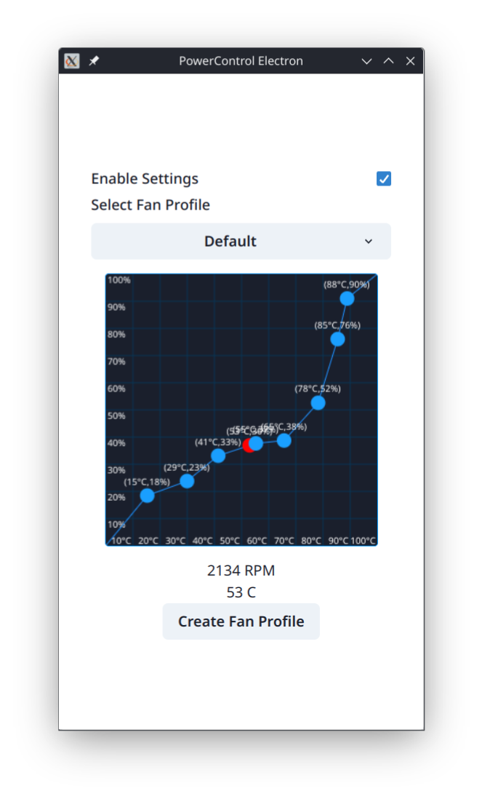

# PowerControl Electron Frontend

Based on Powercontrol frontend, intended to only be used with my [PowerControl fork](https://github.com/aarron-lee/PowerControl).

This frontend only has the fan curve management functionality, none of the TDP-related functionality.

This will NOT work with the main PowerControl plugin

# Requirements

Decky Loader and PowerControl Fork installed

-requires PowerControl Fork v2.0.9

# Features

Fan curve management (Note Fan curves are separate from the PowerControl Fan curves in the plugin)

Tray Icon with `Toggle Window` and `Quit` options:

1. `Toggle Window` option will show/hide the window. this setting is saved across app reboots
2. `Quit` option quits the app

On KDE, right click the tray icon to see options. On Gnome, you need to enable a gnome extension for icons first.

# Disclaimer

created for my own personal use, I will not provide any support. This software is provided as-is, with no warranty, etc

# Attribution

favicon ([cc-by4.0 license](https://creativecommons.org/licenses/by/4.0/)) - https://favicon.io/emoji-favicons/chart-increasing

[PowerControl Decky Plugin](https://github.com/mengmeet/PowerControl)
